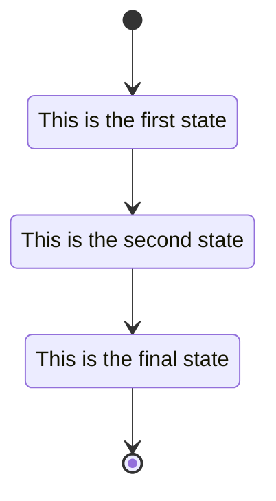

# mesh-ku
```
slowly send files over meshtastic

The SENDER sends file to the RECEIVER:


Sender side
===========

initial-state

Creates session with session-id

expect-confirmation:

TEXT_MESSAGE_APP: `MK-SEND filename date size block-size crc32 version-string session-id`

sleep INIT-PACE, repeat

expect:
  <- see PRIVATE_APP 0xFECC = FECC OFF
  -> initial-state

  <- see PRIVATE_APP 0xACCE = ACCEPT
  -> main-state

block map:
  block[num] = send count

repeat until block map is empty
    pick a block from map
    -> PRIVATE_APP: session-id block-number byte-count [bytes] crc32
    sleep BLOCK-PACE

  expect:
    <- PRIVATE_APP: session-id 0xACCE [bitmap]  -- the bitmap is a big-endian byte array where each bit represents a block, 1 = received
    <- PRIVATE_APP: session-id 0xFECC -- cancel send


Receiver end
============

Expect:


  <- TEXT_MESSAGE_APP with destination = my node
      `MK-SEND filename date size block-size crc32 version-string session-id`

     if session exists, ignore

     create session session-id
       initialize bitmap

     session.receive()

  <- PRIVATE_APP: session_id .... -> sessions[session_id].handle_packet()

for session in sessions: session.loop()

session.loop():
  -> PRIVATE_APP: session-id 0xACCE [bitmap] -- update on all packets
  sleep BLOCK-PACE

session.handle_packet():
  if filemap[block_number] == 0:
    filemape[block_number] = payload
  
  


```



