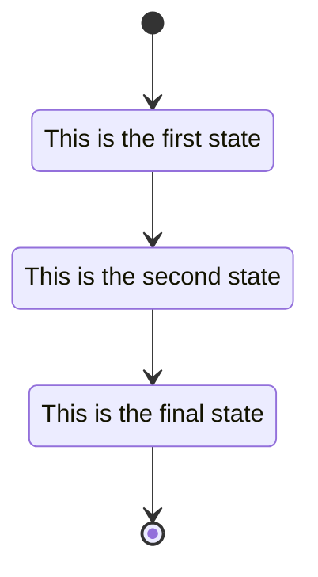

# meshbird
send files over meshtastic

The INITIATOR sends file to the RECIPIENT:

initial-state

Creates session session-id

expect-confirmation:

TEXT_MESSAGE_APP: `MK-SEND file size date crc32 version-string session-id`

sleep INIT-PACE, repeat

expect:
  <- see PRIVATE_APP 0xFECC = FECC OFF
  -> initial-state

  <- see PRIVATE_APP 0xACCE = ACCEPT
  -> main-state

block map:
  block[num] = send count

repeat until block map is empty
    pick a block from map
    -> PRIVATE_APP: session-id block-number byte-count [bytes] crc32
    sleep BLOCK-PACE

  expect:
    <- PRIVATE_APP: session-id 0xACCE [bitmap]  -- the bitmap is a big-endian byte array where each bit represents a block, 1 = received
    <- PRIVATE_APP: session-id 0xFECC -- cancel send

Receiver end
============

Expect:
  <- TEXT_MESSAGE_APP with destination = my node

