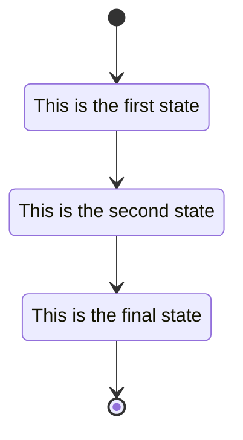

# meshbird
send files over meshtastic

```mermaid
   stateDiagram-v2
        [*] --> StateA
        StateA --> StateB
        StateB --> StateC
        StateC --> [*]

        StateA : This is the first state
        StateB : This is the second state
        StateC : This is the final state
```        